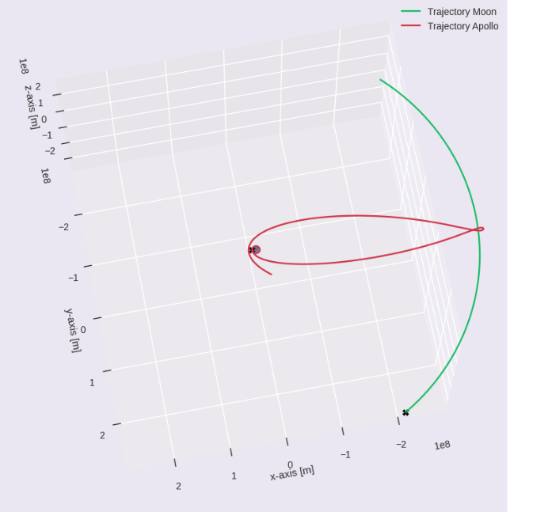
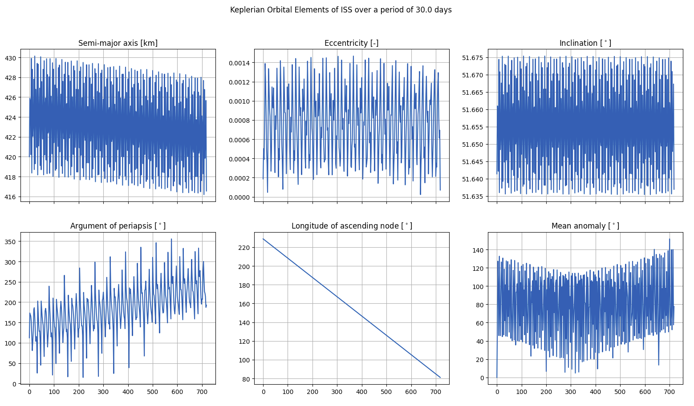

# astro-tools

Astrodynamics library aiming to better visualize orbital mechanincs and showcase transfers, pertubations and others.

Some of the simple usecases include:

1. Initializing a number of satellites orbiting a body, using their Keplerian elements. 

Envisat, the ISS and a geostationary satellite orbiting the Earth

2. Simulating a lunar free return trajectory. 

Apollo 11's free return trajectory around the moon

3. Inspecting the Keplerian orbital elements of a satellite under the influence of J2, drag, nbody and other pertubations.

ISS's KOE's after a month in orbit

